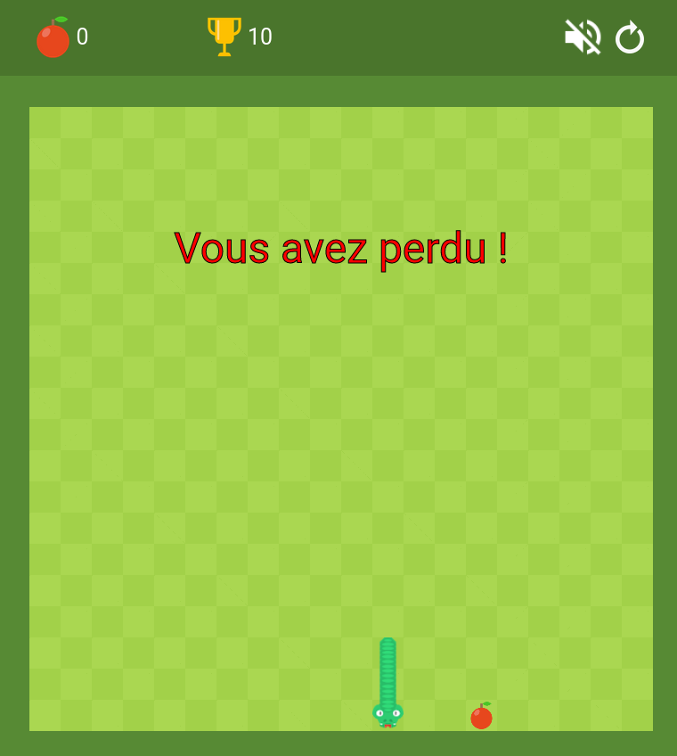

# Snake

Application Web, permettant de jouer à snake.

Vous pouvez jouer ici
https://duffscs.github.io/Snake/

## Contexte :

J'ai réalisé cette application durant les vacances d'hiver pour m'initier au langage javascript.

## Réalisation :

Dans ce repository vous retrouverez le code de l'application. 
Bien évidement celle-ci est réalisée en Programation Orientée Objet donc en utilisant les Javascript Class.  
Pour l'utiliser, il suffit d'appuyer sur les touches ZQSD ou les flèches

## Contributeur :
- https://github.com/Duffscs
